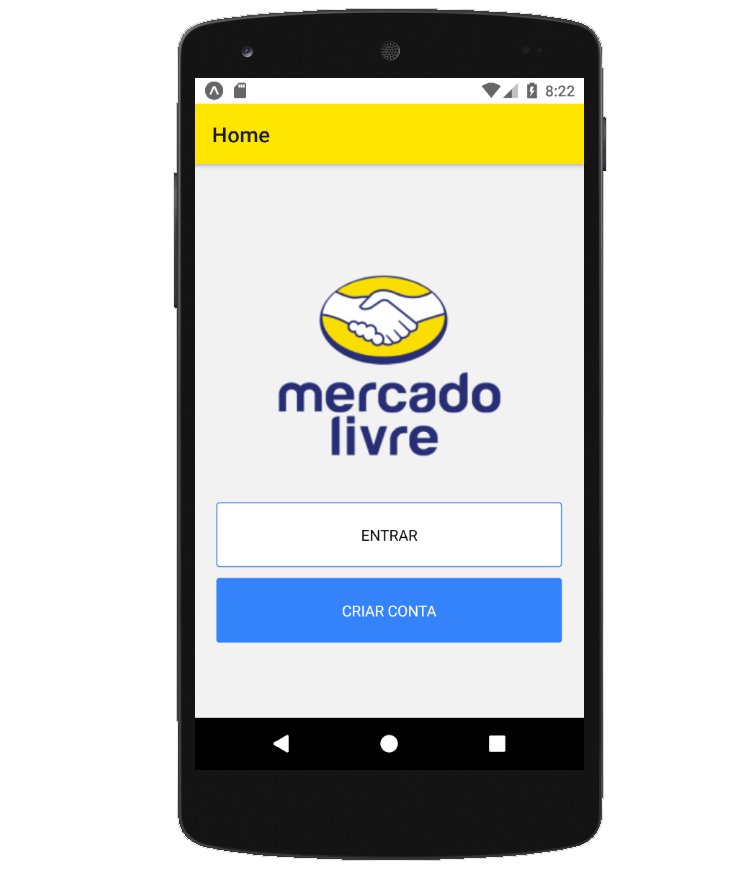

# Mercado Livre Clone

Mercado Livre Clone is the project from a course from [Digital Innovation One](https://digitalinnovation.one/) and it´s made with [React Native](https://reactnative.dev). The purpose is to recreate [Mercado Livre ](https://www.mercadolivre.com.br/) main screen and show some integration with [Firebase](https://firebase.google.com/)


<p align="center">
    
</p>

---

# Guide

* [Features](#features)
* [Installation](#installation)
* [Using](#using)
* [Technologies](#technologies)
* [Future Implementations](#future-implementations)


# Features

It has some screens. The main one, you can create and account that´s recordand on [Firebase](https://firebase.google.com/).


# Installation

**You will need install:**

 [Node.js](https://nodejs.org/en/download/) <br />
 [Yarn](https://classic.yarnpkg.com/en/) 

**Cloning repository**

```git clone https://github.com/cledman/react-native-mercado-livre```

**Install dependencies **

```yarn install```

**Configuration **

check the SERVICES\FIREBASE.JS and post your data

# Using

```expo start```

# Technologies

* [NodeJS](https://nodejs.org/en/) to handle the server, 
* [React](https://reactjs.org) to handle the rendering, 
* [Expo](https://expo.io/) to handle emulation

# Future Implementations

*  Create categories pages.
*  Modal windows for messagens and alerts
*  Themes changes
*  Better UI

Thanks to:
* [Pablo Henrique](https://www.linkedin.com/in/pablohdev/) and  [Digital Innovation One](https://digitalinnovation.one/)
##